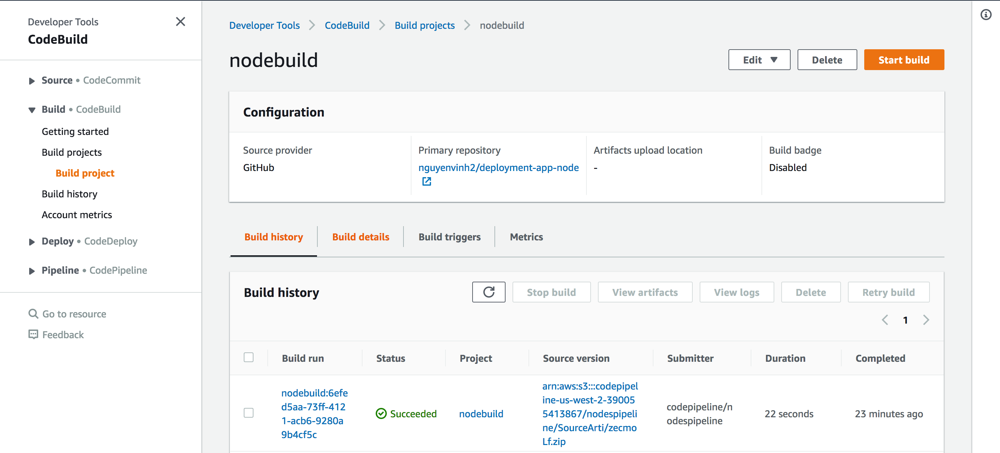
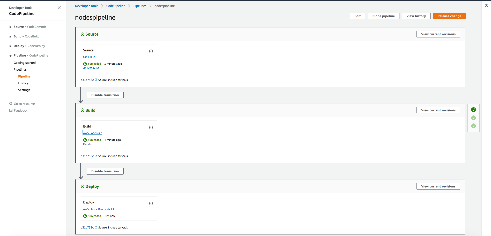

# doc-pipeline-app

## Build Stage Instructions for Node.js

### Reposistory Set-up
- Include a buildspec.yml file in the root of your directory:

Ex:

```
version: 0.2

phases:
  install:
    runtime-versions:
      nodejs: 10  
    commands:
  pre_build:
    commands:
      - npm install
      - npm test
  build:
    commands:
  post_build:
    commands:
      - echo completed on `date`
artifacts:
  files:
    - index.js
    - index.test.js
    - package.json
    - node_modules/async/*
    - node_modules/lodash/*
    - lib/server.js
```

- Do not change the version#, that is AWS's versioning system
- Be sure to include the desired nodejs run-time version
- Insert the desired node commands within the different phases of the build process:
  - install
  - pre_build
  - build
  - post_build
- Include all the files needed for your application to work.

Repository Example: https://github.com/nguyenvinh2/deployment-app-node

### AWS Codebuild Set-up

- In your AWS Console Web Application, access the CodeBuild Service (expand the services tab at the top and type in codebuild to bring it up)
- Click "Create Build Project"
- Under "Project Configuration"
  - Give the project a name and description
- Under "Source"
  - Connect to your Github repository
- Under "Environment"
  - Select desired image. Recommend selecting managed image and select the desired OS
- Under "Buildspec"
  - Select "Use a buildspec file" if you added the buildspec.yml file to your repository as mentioned above
  - Otherwise, AWS CodeBuild will allow you to add the desired node commands to set up your buildspec file
- Customize other options as desired and click Create Build Project. AWS will then create your configurations.
- View your newly created build project and test it buy clicking Start build. It should look something like this:



### CodePipeline Set-up

#### Pre Set-up

- Visit https://github.com/Paula9t9/doc-pipeline-node and follow the instructions
until the Step 3: Build section. DO NOT SKIP THIS STAGE.

#### Build Stage Set-up

- Select AWS CodeBuild as the Build Provider
- Select the desired Region and the Build project you setup previously should now appear
- Proceed to the Deploy Stage, continue with the Pre Set-up instructions from where you left off to complete it.
- The Code Pipeline should now include your build process in its continuous integration and deployment.



Congrats! you now have a deployed site, just like me:
http://nodepipeline.ctrwv48puz.us-west-2.elasticbeanstalk.com/
